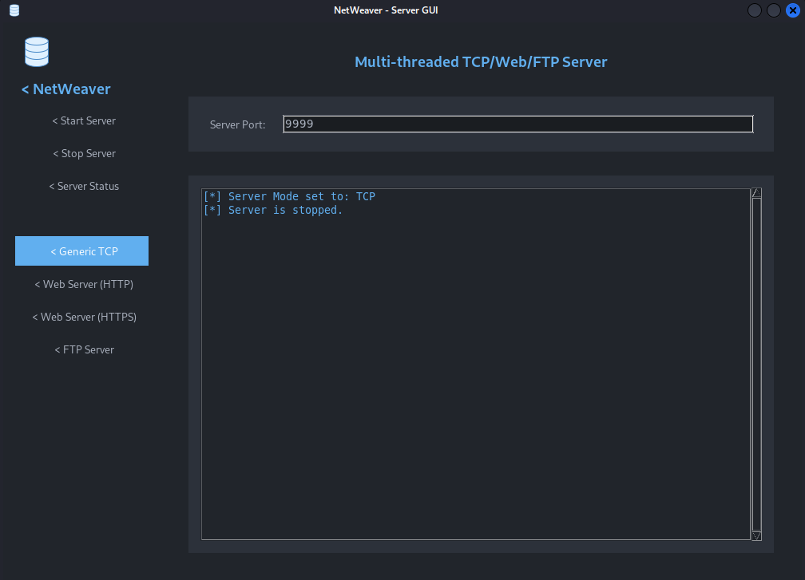

The GUI

## Table of contents

- [Features](#Introduction)
- [Prerequisites](#prerequisites)
- [Project Structure](#project-structure)
- [Setup and Installation](#setup-and-installation)
- [Running the Application](#running-the-application)
- [Using the GUI](#using-the-gui)
    - [Server Controls](#server-controls)
    - [Server Modes](#server-modes)
        - [Generic TCP Server](#generic-tcp-server)
        - [Web Server (HTTP)](#web-server-http)
        - [Web Server (HTTPS)](#web-server-https)
        - [FTP Server](#ftp-server)
    - [Log Area](#log-area)
- [Troubleshooting](#troubleshooting)
- [Contributing](#contributing)
- [License](#license)

NetWeaver - Multi-threaded TCP/Web/FTP Server

A versatile, multi-threaded server application with a graphical user interface, supporting generic TCP, HTTP/HTTPS, and FTP protocols.
Table of Contents

    Introduction

    Features

    Installation

    Usage

    Configuration

    Contributing

    License

    Contact

## Introduction

NetWeaver is a Python-based server application designed to provide flexible network services through a user-friendly graphical interface. It supports handling multiple client connections concurrently across different protocols, including a generic TCP server, a web server (HTTP and HTTPS), and an FTP server. The application aims to offer a simple yet powerful tool for testing network communications and serving files.
Features

    Multi-threaded Architecture: Handles multiple client connections simultaneously without blocking the main application thread.

    Multiple Server Modes:

        Generic TCP Server: For basic TCP communication and testing.

        Web Server (HTTP): Serves static files from a specified root directory.

        Web Server (HTTPS): Provides secure web serving using SSL/TLS with user-provided certificate and key files.

        FTP Server: Supports basic FTP commands for file listing, retrieval, and storage, with user authentication.

    Intuitive Graphical User Interface (GUI): Built with Tkinter, featuring a modern dark theme for easy configuration and real-time logging.

    Real-time Logging: Displays server activity, client connections, requests, and errors directly within the GUI.

    File System Security: Implements checks to prevent directory traversal attacks for both web and FTP serving.

    Configurable Root Directories: Allows users to specify separate root directories for web and FTP content.

    SSL/TLS Support: Enables secure communication for the HTTPS server mode.

    Basic FTP Commands: Supports USER, PASS, PWD, CWD, LIST, RETR, STOR, PORT, and PASV commands.

Installation

NetWeaver is a Python application. To run it, you need Python 3 installed on your system. You will also need to install the Pillow library for GUI icon support.

    Clone the repository (or download the files):

    git clone https://github.com/mrblue223/NetWeaver.git
    cd Netweaver

  

    Install dependencies:

    python3 install_dependencies.py

    Ensure the assets directory exists:
    Make sure the assets/icons8-server-40.png file is present in the Netweaver/assets/ directory for the GUI icon to display correctly. If not, you can download it or provide your own icon.

Usage

To start the NetWeaver server GUI, simply run the main.py script:

python main.py

Once the GUI launches:

    Select Server Mode: Choose between "Generic TCP", "Web Server (HTTP)", "Web Server (HTTPS)", or "FTP Server" from the sidebar.

    Configure Settings:

        Server Port: Enter the desired port number.

        Web Root Dir / FTP Root Dir: If using Web or FTP modes, click "Browse..." to select the directory from which files will be served.

        SSL Cert File / SSL Key File: If using HTTPS mode, click "Browse..." to select your SSL certificate (.pem) and key (.pem) files.

    Start Server: Click the "Start Server" button in the sidebar.

    Monitor Log: Observe server activity, client connections, and any errors in the log area.

    Stop Server: Click the "Stop Server" button to shut down the server.

FTP Server Credentials:
The FTP server currently uses hardcoded credentials:

    Username: ftpuser

    Password: ftppass

Configuration

All primary configuration is done through the GUI. The constants.py file holds default values and theme settings, but runtime configurations (port, root directories, SSL files, server mode) are managed via the GUI inputs.

    SERVER_PORT: Configured via the GUI.

    WEB_ROOT_DIR: Configured via the GUI for Web/HTTPS modes.

    FTP_ROOT_DIR: Configured via the GUI for FTP mode.

    SSL_CERT_FILE: Configured via the GUI for HTTPS mode.

    SSL_KEY_FILE: Configured via the GUI for HTTPS mode.

Contributing

Contributions are welcome! If you find a bug, have a feature request, or want to contribute code, please follow these guidelines:

    Report Bugs: Open an issue on the GitHub repository with a clear description of the bug, steps to reproduce it, and expected behavior.

    Suggest Features: Open an issue to propose new features or enhancements.

    Submit Pull Requests:

        Fork the repository.

        Create a new branch for your changes (git checkout -b feature/your-feature-name or bugfix/your-bug-name).

        Make your changes and ensure the code adheres to existing style.

        Write clear, concise commit messages.

        Push your branch and open a pull request.

License

This project is licensed under The Unlicense - see the LICENSE file for details.

For any questions or inquiries, please contact:

    Project Repository: https://github.com/mrblue223/NetWeaver.git
